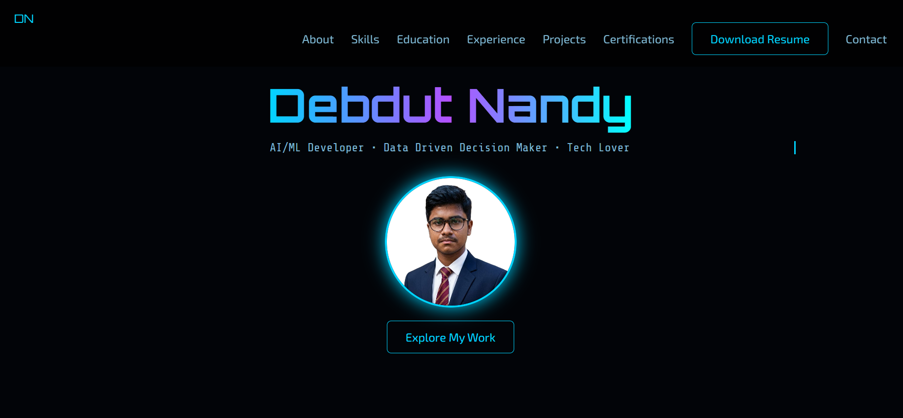

<h1 align="center">Hi 👋, I'm Debdut Nandy</h1>

<h3 align="center">🚀 AI/ML Developer | 💡 Data-Driven Thinker | ⚡ Tech Enthusiast</h3>

---

## 🌐 Live Portfolio  
<p align="center">
  <a href="https://deb124-source.github.io/Personal-Portfolio-Website/">
    
  </a>
</p>

---

## 🧠 About This Project  

✨ Personal Portfolio Website to showcase:  
💼 Projects | 🧠 Skills | 📄 Resume | 📬 Contact  

⚡ Clean UI with smooth animations and responsive design.

---

## ⚙️ Tech Stack  

<p align="center">
  
</p>

<p align="center">
  
</p>

---

## ✨ Features  

🚀 Smooth animations  
📱 Responsive design  
📂 Project showcase  
📥 Resume download  
🔗 Social links  

---

## 🎥 Preview  

<p align="center">
  
</p>

---

## 🧩 Setup  

```bash
git clone https://github.com/Deb124-source/Personal-Portfolio-Website.git
cd Personal-Portfolio-Website
```
---

## 🚀 Deployment
<p align="center">  </p>

---

## 🤝 Connect
<p align="center"> <a href="https://www.linkedin.com/in/debdut-nandy-4b0a88321/">  </a> <a href="mailto:debdut937@gmail.com">  </a> <a href="https://github.com/Deb124-source">  </a> </p>

---

## ⭐ Support
Give a ⭐ if you like this project!

